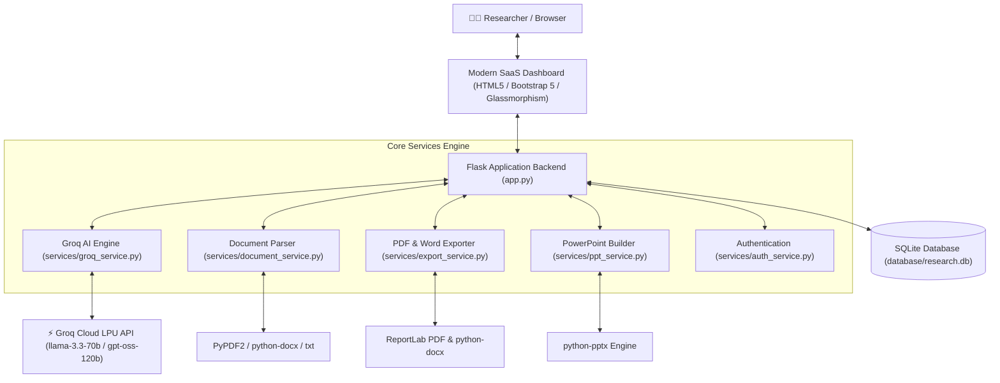

# 🤖 AI Research Assistant & Copilot (2026 Enterprise Edition)

An enterprise-grade, high-velocity AI Academic Research Platform powered by **Groq High-Speed LLM LPUs**, built with Python **Flask**, **SQLite**, **ReportLab**, **python-docx**, and **python-pptx**. Designed for seamless local execution and 1-click cloud deployment on **Render.com**.

---

## 🌟 Key Features

### 1. 📄 Academic Research Reports Studio
- **SOTA Literature Surveys**: Structured academic generation containing Abstract, Problem Formulation, Architecture, Literature Review, Gaps, Proposed Methodology, Ethical Dimensions, and APA References.
- **Export Formats**: One-click export to publication-ready **PDF** (with headers, running footers, and page numbers), Microsoft Word **DOCX**, and clean **Markdown (.md)**.
- **Persistent History**: Searchable sidebar history drawer with starred favorites and deletion controls.

### 2. 📊 AI Presentation Deck Generator
- **16:9 Widescreen Slides**: Automatically structures and builds PowerPoint `.pptx` decks.
- **Dynamic Slide Counts**: Select from 5, 8, 10, 12, or 15 slides according to your presentation type.
- **5 Professional Design Themes**:
  - **Modern Indigo** (Tech conference, AI symposiums)
  - **Obsidian Executive** (Formal defense, executive board briefings)
  - **Royal Blue Corporate** (Industry research, enterprise summits)
  - **Cyber Teal** (Engineering, biotechnology, physics)
  - **Warm Academic** (Education, thesis lectures)
- **Interactive Deck Preview**: In-browser slide cards preview with instant automatic file download.

### 3. 🔍 12-Mode Research Document & Paper Analyzer
- **Multi-Format Extraction**: Ingests PDF (`.pdf`), Microsoft Word (`.docx`), and Plain Text (`.txt`) up to 32MB.
- **12 Specialized AI Extraction Tools**:
  - *Core Insights*: Executive Summary, Academic Abstract, Key Findings (Top 10), Keywords Matrix with Glossary.
  - *Deep-Dive*: Methodology Breakdown, Core Novelty, Research Gaps, Limitations & Threats to Validity, Future Directions, Foundational Citations.
  - *Learning & Defense*: 10-Question Interactive Quiz with Answer Key, Viva / Technical Interview Defense Preparation, Complex Concept Explanations with Analogies.
- **Grounded Document Q&A**: Ask any question and receive answers strictly verified against document context without hallucinations.

### 4. 💬 Persistent AI Research Copilot Chat
- **Threaded Memory**: Conversations are saved into SQLite database threads so your research history is never lost.
- **Rich Markdown & Math**: Renders formulas, tables, bold highlights, and code blocks with one-click copy.
- **Curated Prompt Presets**: Jumpstart exploration with one-click research suggestions.

### 5. ⚡ Ultra-Fast Groq Inference Engine
- Powered by Groq's high-throughput LPU infrastructure (500+ tokens/second).
- Automatic model fallback hierarchy: `llama-3.3-70b-versatile` &rarr; `llama-3.1-8b-instant` &rarr; `openai/gpt-oss-120b` &rarr; `mixtral-8x7b-32768`.

---

## 🏗️ System Architecture



---

## 🚀 Local Run Instructions

### Prerequisites
- Python 3.10, 3.11, or 3.12 installed.
- A free Groq API key from [Groq Console](https://console.groq.com/keys).

### Step 1: Clone or Navigate to the Workspace
```powershell
cd "e:\AI Research Chatbot"
```

### Step 2: Set Up Virtual Environment
```powershell
# Create virtual environment (if not already present)
python -m venv venv

# Activate virtual environment
# Windows PowerShell:
.\venv\Scripts\Activate.ps1
# Windows Command Prompt:
.\venv\Scripts\activate.bat
# Linux/macOS:
source venv/bin/activate
```

### Step 3: Install Dependencies
```powershell
pip install --upgrade pip
pip install -r requirements.txt
```

### Step 4: Configure Environment Variables
Create or verify your `.env` file in the root folder:
```ini
# Required: Your Groq API key
GROQ_API_KEY=gsk_your_actual_groq_api_key_here

# Optional: Preferred model (defaults to llama-3.3-70b-versatile)
GROQ_MODEL=llama-3.3-70b-versatile

# Secret Key for Flask sessions
SECRET_KEY=replace_with_a_secure_random_string

# Port (defaults to 5000)
PORT=5000

# Debug mode
FLASK_DEBUG=false
```

### Step 5: Start the Application
```powershell
python app.py
```
Open your browser at **[http://localhost:5000](http://localhost:5000)**.
Create an account on the registration page and start researching!

---

## ☁️ Deployment Instructions for Render (Render.com)

This repository includes pre-configured `Procfile`, `render.yaml`, and `runtime.txt` tailored specifically for Render.

### Method A: Blueprint Deployment (Recommended & Fastest)
1. Push your repository to **GitHub** or **GitLab**.
2. Go to [Render Dashboard](https://dashboard.render.com).
3. Click **New +** &rarr; **Blueprint**.
4. Connect your repository.
5. Render will automatically read `render.yaml` and configure:
   - Build Command: `pip install --upgrade pip && pip install -r requirements.txt`
   - Start Command: `gunicorn app:app --workers 2 --threads 4 --timeout 120 --bind 0.0.0.0:$PORT`
   - Health Check Path: `/health`
6. Enter your `GROQ_API_KEY` under the Environment Variables prompt.
7. Click **Apply**. Your app will be live within 2 minutes!

---

### Method B: Manual Web Service Setup
1. On the [Render Dashboard](https://dashboard.render.com), click **New +** &rarr; **Web Service**.
2. Connect your Git repository.
3. Configure settings:
   | Setting | Value |
   | :--- | :--- |
   | **Name** | `ai-research-assistant` |
   | **Region** | `Oregon (US West)` or nearest |
   | **Branch** | `main` |
   | **Runtime** | `Python 3` |
   | **Build Command** | `pip install --upgrade pip && pip install -r requirements.txt` |
   | **Start Command** | `gunicorn app:app --workers 2 --threads 4 --timeout 120 --bind 0.0.0.0:$PORT` |
   | **Instance Type** | `Free` |
4. Under **Environment Variables**, add:
   - `GROQ_API_KEY`: *(Your Groq API key)*
   - `GROQ_MODEL`: `llama-3.3-70b-versatile`
   - `SECRET_KEY`: *(Click Generate or enter a secret string)*
   - `PYTHON_VERSION`: `3.12.0`
5. Under **Advanced**, set **Health Check Path** to `/health`.
6. Click **Deploy Web Service**.

---

## 📂 Project Directory Structure

```text
├── app.py                     # Main Flask Application & Controllers
├── config.py                  # Centralized Configuration & Environment Manager
├── requirements.txt           # Python Dependency Manifest
├── Procfile                   # Gunicorn Process Definition for Render
├── render.yaml                # Infrastructure-as-Code Blueprint for Render
├── runtime.txt                # Cloud Python Runtime Version
├── .env.example               # Reference Environment Variable Template
├── .gitignore                 # Git ignore rules
│
├── database/
│   └── research.db            # Persistent SQLite Database
│
├── services/
│   ├── groq_service.py        # Groq Client, Reports & 12-Tool Analyzer
│   ├── chat_service.py        # Chat Intelligence & Context Handlers
│   ├── document_service.py    # Robust PDF, DOCX, TXT Extractor
│   ├── export_service.py      # Unicode-Safe PDF, DOCX, Markdown Exporter
│   ├── ppt_service.py         # Multi-Theme PowerPoint 16:9 Generator
│   ├── auth_service.py        # User Authentication & Secure Hashing
│   └── database.py            # SQLite Connection Pool & Query Methods
│
├── templates/
│   ├── base.html              # Unified SaaS Layout (Sidebar, Topbar, Drawers)
│   ├── dashboard.html         # Main Executive Research Dashboard
│   ├── reports.html           # AI Research Reports Studio & Exporter
│   ├── presentation.html      # PowerPoint Deck Generator Studio
│   ├── analyzer.html          # Document & Paper 12-Tool Analyzer
│   ├── documents.html         # Research Papers Library & Viewer
│   ├── chat.html              # Threaded AI Copilot Chat
│   ├── login.html             # Sleek Sign-In Page
│   └── register.html          # Account Registration Page
│
└── static/
    ├── css/
    │   └── dashboard-pro.css  # 2026 Modern Design System & Component Library
    └── js/
        ├── common-pro.js      # Toast Notifications, Theme & Markdown Helpers
        ├── dashboard.js       # Live Dashboard Analytics & Trends
        ├── reports.js         # Report Generation, Exporters & Drawer
        ├── presentation.js    # Deck Studio & Interactive Preview
        ├── analyzer.js        # 12-Tool Analysis Engine & Grounded Q&A
        ├── documents.js       # Paper Library & File Management
        └── chat.js            # Threaded Chat Engine & Auto-Scroll
```

---

## 🔒 Security & Best Practices
- **Password Protection**: Passwords hashed using PBKDF2/SHA256 with salts via Werkzeug.
- **Sanitized Uploads**: Filenames sanitized with `secure_filename()` and unique UUID prefixes to prevent overwrites or path traversals.
- **Input Size Restrictions**: Maximum file upload capped at 32MB to prevent denial-of-service.
- **Safe PDF Compilation**: Full XML escaping and unicode normalization to prevent ReportLab font mapping errors.
